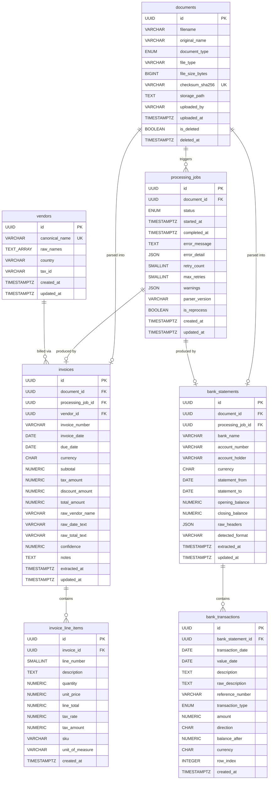

# Database Design & ER Diagram
## Invoice & Bank Statement Parsing API

This document describes the relational database design for the FastAPI backend, detailing the tables, field types, constraints, and relationships. It includes the complete Mermaid ER diagram at the end.

---

## 1. Domain Entities & Database Tables

The database is built around **8 core tables** designed to handle raw files, parsing jobs, invoices, bank statements, transactions, and tags.

### 1. `documents` (Raw File Registry)
* **Purpose**: Immutable registry of all uploaded files. Every upload creates a new row. Soft-deletes are supported.
* **Primary Key**: `id` (UUID)
* **Keys & Indexes**: 
  * `checksum_sha256` (VARCHAR, Unique Index): Computes SHA-256 to detect duplicate uploads.
* **Consistency Check**: Constraint ensures that if `is_deleted` is true, `deleted_at` is populated, and vice-versa.

### 2. `processing_jobs` (Parsing Lifecycle Tracker)
* **Purpose**: Tracks the asynchronous lifecycle of parsing a document.
* **Status Enum**: `pending` | `processing` | `completed` | `failed` | `partial`
* **Features**:
  * Tracks average OCR confidence, scanned pages, and password protection flags for PDFs.
  * Captures detailed parsing failure call stacks or field warnings in JSON structures.
  * Allows multiple jobs per document if `allow_reprocess=true` is passed.

### 3. `vendors` (Normalized Vendor Registry)
* **Purpose**: Stores deduplicated vendors to prevent redundancy (e.g. mapping "Amazon", "Amazon Inc.", "AMAZON CO" to a single canonical entity).
* **Canonical Matching**: Constraints enforce that `canonical_name` is unique (case-insensitive exact match).
* **Raw Variation Track**: `raw_names` (Text Array) records all raw name variations encountered during parsing for future matching heuristics.

### 4. `invoices` (Extracted Invoice Data)
* **Purpose**: Captures invoice headers, dates, tax amounts, and totals extracted from PDFs.
* **Relations**: Linked to `documents.id` (ON DELETE CASCADE), `processing_jobs.id`, and `vendors.id` (nullable).
* **Parser Metadata**: Contains a `confidence` decimal (0.000 to 1.000) and raw string fields to compare OCR outputs with final parsed values.

### 5. `invoice_line_items` (Invoice Line Items)
* **Purpose**: Breaks down the sub-items billed in each invoice (quantity, unit price, totals, tax, SKU, and unit of measure).
* **Order Constraint**: Unique index on `(invoice_id, line_number)` ensures consistent line ordering.

### 6. `bank_statements` (Statement-Level Metadata)
* **Purpose**: Capture metadata associated with a bank statement file (bank name, account owner, statement period, and opening/closing balances).
* **Security**: `account_number` is stored masked (e.g. `****4321`) to protect client data.
* **Quality Auditing**: Stores delimiter, encoding, format, and raw headers JSON.

### 7. `bank_transactions` (Individual Transactions)
* **Purpose**: Holds parsed transactional ledger rows from CSV statements.
* **Sign Safety**: `amount` is strictly positive (`CHECK (amount >= 0)`) with an explicit `direction` column (`C` = Credit, `D` = Debit).
* **Transaction Types**: Enum values range from `credit`, `debit`, `transfer`, `fee`, `interest`, to `unknown` based on transaction description patterns.

---

## 2. Entity Relationship (ER) Diagram

Below is the Mermaid visual representation of the schemas and foreign key relationships.

---

## 3. Database Constraints & Money Safety Rules

1. **Money Representation**: Float datatypes are forbidden. Numeric/Decimal (`sa.Numeric(18, 4)`) is used for all subtotals, tax rates, balances, and transaction amounts.
2. **Sign Enforcement**: Amounts are stored unsigned (`amount >= 0`) combined with an explicit check constraint: `CHECK (direction IN ('C', 'D'))` to eliminate signs mismatch bugs.
3. **Soft-deletion Consistency**: `CHECK ((is_deleted = FALSE AND deleted_at IS NULL) OR (is_deleted = TRUE AND deleted_at IS NOT NULL))` protects documents state.
4. **Ordering Integrity**: A unique index on `(invoice_id, line_number)` for invoice line items and `(bank_statement_id, row_index)` for statement transactions prevents accidental duplicate insert overlays.
