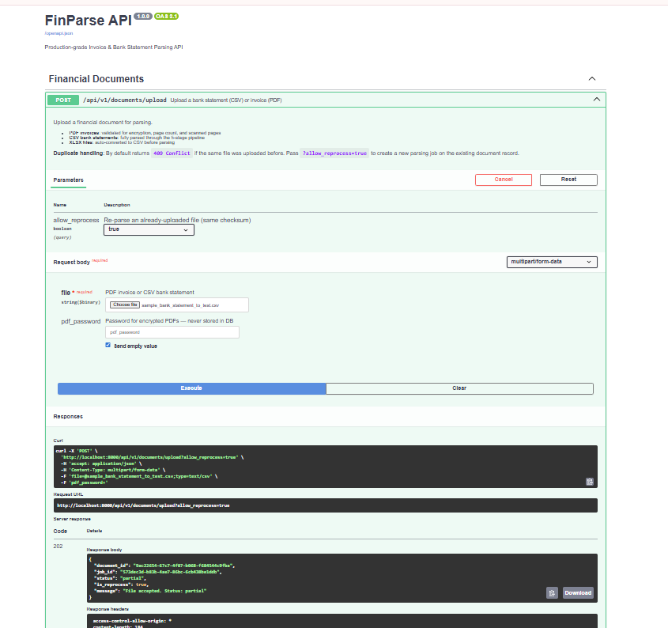
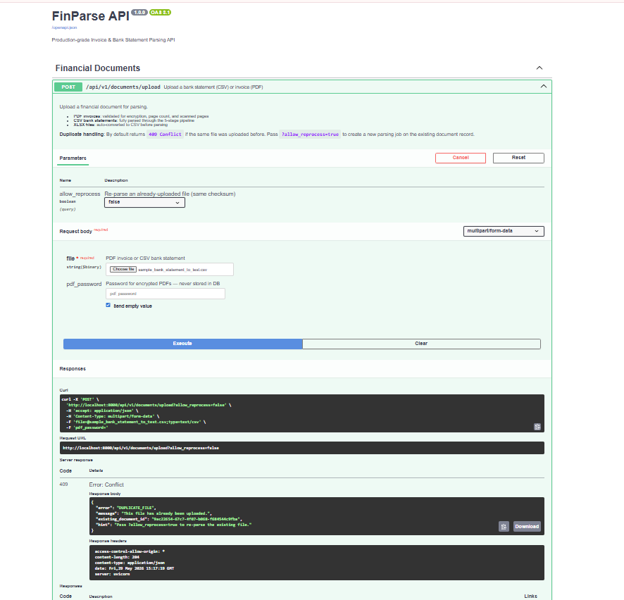
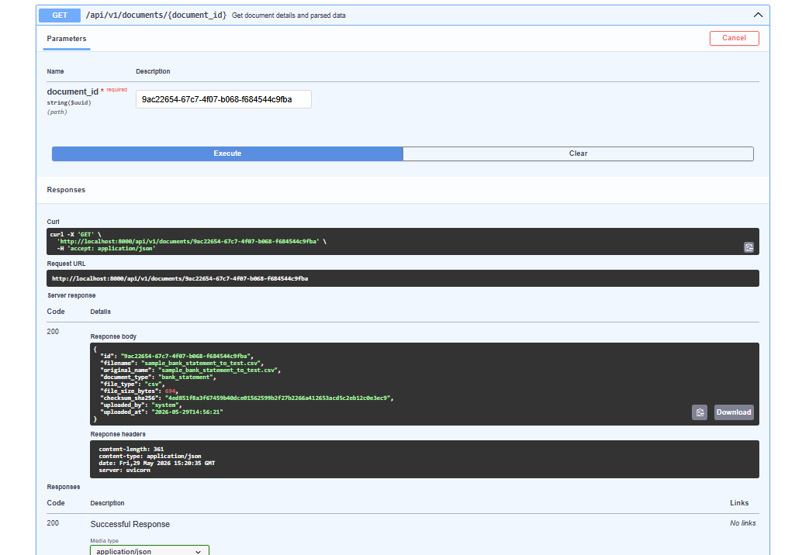
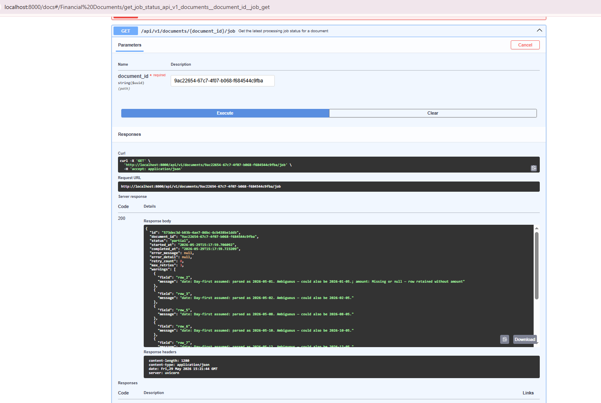
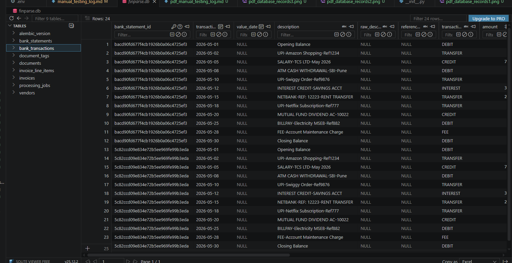
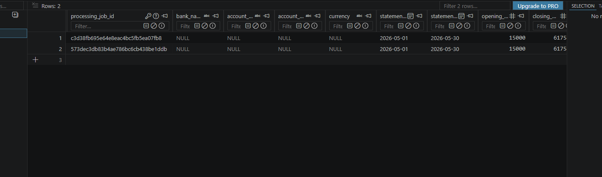

# Manual Testing Log — CSV Statement Upload

This document logs the manual testing of the CSV Bank Statement parsing and retrieval endpoints using the auto-generated sample file.

## Test File
* **Filename**: `sample_bank_statement_to_test.csv`
* **Purpose**: Test the CSV parsing pipeline, duplicate checking, database persistence, and Pydantic serialization.

---

## 1. POST /api/v1/documents/upload

Upload the CSV file using Swagger UI at `http://localhost:8000/docs`.

### Request Parameters
* **file**: `sample_bank_statement_to_test.csv`
* **allow_reprocess**: `false` (default)

### API Response
```json
{
  "document_id": "9ac22654-67c7-4f07-b068-f684544c9fba",
  "job_id": "c3d38fb6-95e6-4e8e-ac4b-c5fb5ea07fb8",
  "status": "partial",
  "is_reprocess": false,
  "message": "File accepted. Status: partial"
}
```

### Response Screenshot


### Duplicate Upload (allow_reprocess = false)
Uploading the exact same file bytes a second time should return a `409 Conflict` error:
```json
{
  "error": "DUPLICATE_FILE",
  "message": "This file has already been uploaded.",
  "hint": "Pass ?allow_reprocess=true to re-parse the existing file.",
  "existing_document_id": "9ac22654-67c7-4f07-b068-f684544c9fba"
}
```


---

## 2. GET /api/v1/documents/{document_id}

Retrieve the metadata of the uploaded document using the `document_id` returned in the upload step.

### Request Path
* **document_id**: `9ac22654-67c7-4f07-b068-f684544c9fba`

### API Response
```json
{
  "id": "9ac22654-67c7-4f07-b068-f684544c9fba",
  "filename": "sample_bank_statement_to_test.csv",
  "original_name": "sample_bank_statement_to_test.csv",
  "document_type": "bank_statement",
  "file_type": "csv",
  "file_size_bytes": 694,
  "checksum_sha256": "4ed851f8a3f67459b40dce01562599b2f27b2266a412653acd5c2eb12c0e3ec9",
  "uploaded_by": "system",
  "uploaded_at": "2026-05-29T14:56:21"
}
```

### Response Screenshot


---

## 3. GET /api/v1/documents/{document_id}/job

Retrieve the status and parser warnings (if any) of the processing job.

### Request Path
* **document_id**: `YOUR_DOCUMENT_UUID`

### API Response
```json
{
  "id": "573dec3d-b83b-4ae7-86bc-6cb438be1ddb",
  "document_id": "9ac22654-67c7-4f07-b068-f684544c9fba",
  "status": "partial",
  "started_at": "2026-05-29T15:17:59.706092",
  "completed_at": "2026-05-29T15:17:59.723209",
  "error_message": null,
  "error_detail": null,
  "retry_count": 0,
  "max_retries": 3,
  "warnings": [
    {
      "field": "row_2",
      "message": "date: Day-first assumed: parsed as 2026-05-01. Ambiguous — could also be 2026-01-05.; amount: Missing or null — row retained without amount"
    },
    {
      "field": "row_3",
      "message": "date: Day-first assumed: parsed as 2026-05-02. Ambiguous — could also be 2026-02-05."
    },
    {
      "field": "row_5",
      "message": "date: Day-first assumed: parsed as 2026-05-08. Ambiguous — could also be 2026-08-05."
    },
    {
      "field": "row_6",
      "message": "date: Day-first assumed: parsed as 2026-05-10. Ambiguous — could also be 2026-10-05."
    },
    {
      "field": "row_7",
      "message": "date: Day-first assumed: parsed as 2026-05-12. Ambiguous — could also be 2026-12-05."
    },
    {
      "field": "row_13",
      "message": "amount: Missing or null — row retained without amount"
    }
  ],
  "parser_version": "csv-parser-v1.0.0",
  "is_reprocess": true,
  "pdf_password_used": false,
  "pdf_encryption_type": null,
  "ocr_used": false,
  "ocr_engine": null,
  "ocr_confidence_avg": null,
  "scanned_pages": null,
  "created_at": "2026-05-29T15:17:59",
  "updated_at": "2026-05-29T15:17:59"
}
```

### Response Screenshot


---

## 4. Database Records Verification

Verify that the records are successfully committed to the database tables:
* **bank_statements**: metadata corresponding to the bank statement (bank name, account holder, balance limits).
* **bank_transactions**: multiple transaction records matching dates, values, descriptions, and directions (debit/credit).

### Database Verification Screenshot (DBeaver / TablePlus / pgAdmin)
*(User will attach the database tables screenshot here)*


