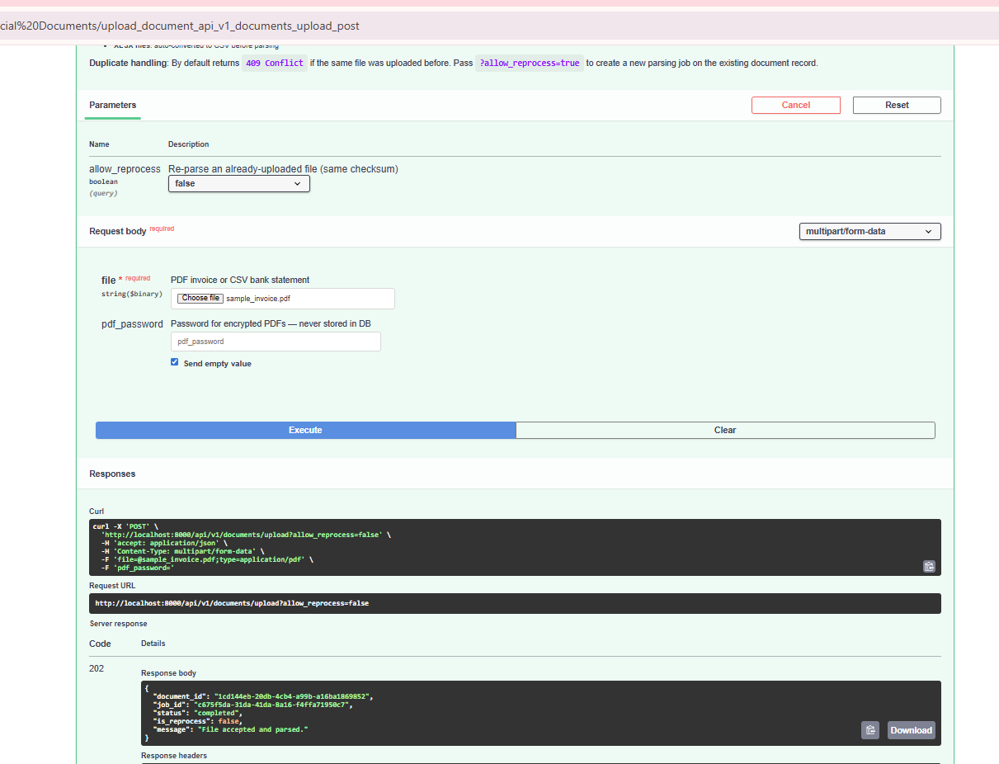
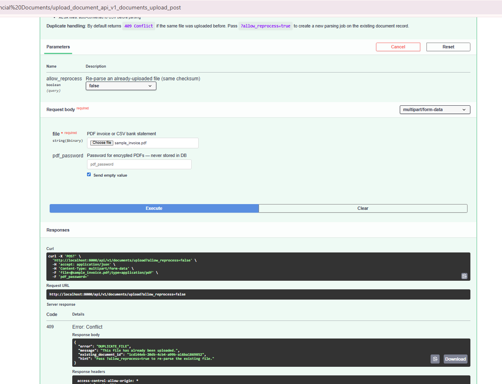
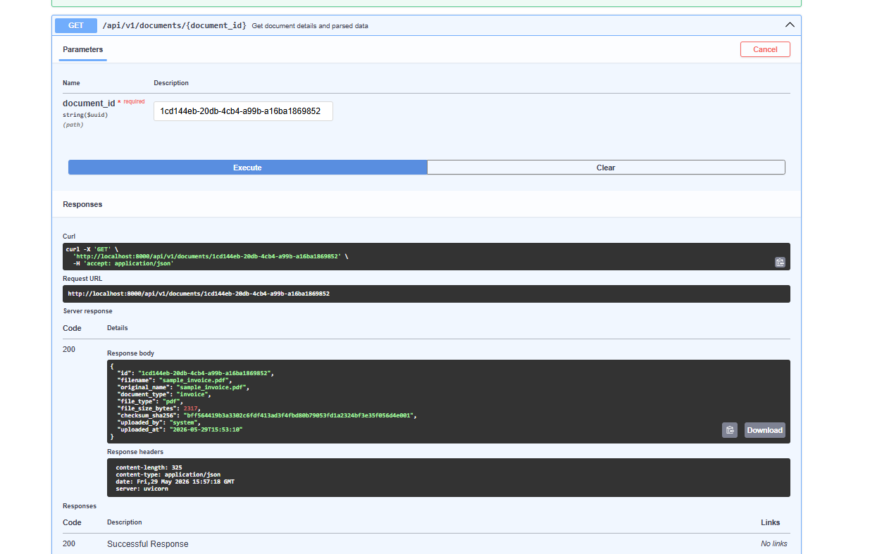
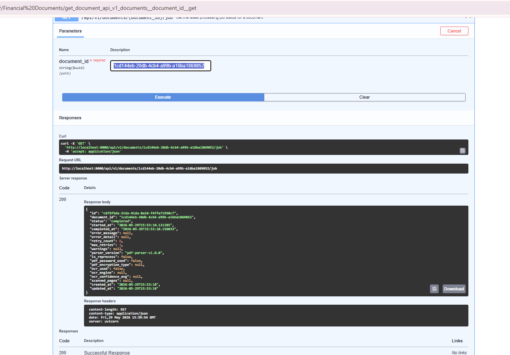
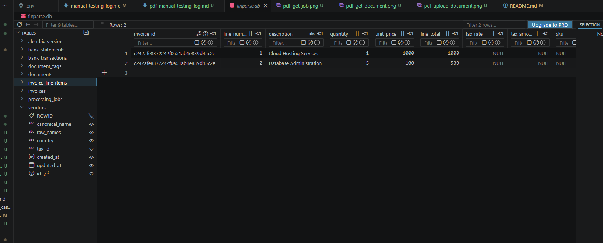
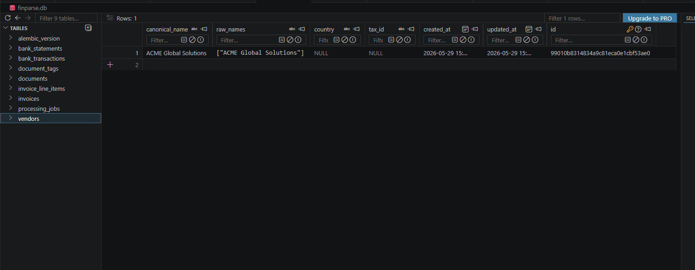
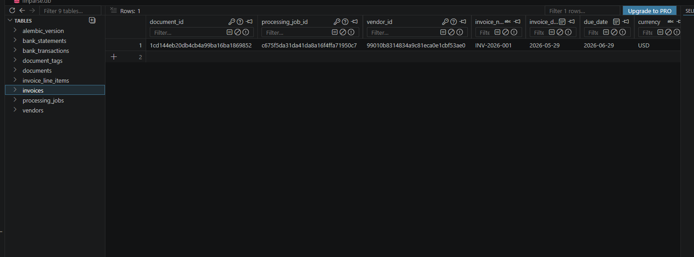

# Manual Testing Log — PDF Invoice Upload

This document logs the manual testing of the PDF Invoice parsing, vendor mapping, database persistence, and job retrieval endpoints using the auto-generated sample file.

## Test File
* **Filename**: `sample_invoice.pdf` (generated via ReportLab)
* **Purpose**: Test the PDF invoice text/table heuristics parsing, case-insensitive vendor deduplication, database persistence, and Pydantic serialization.

---

## 1. POST /api/v1/documents/upload

Upload the `sample_invoice.pdf` file using Swagger UI at `http://localhost:8000/docs`.

### Request Parameters
* **file**: `sample_invoice.pdf`
* **allow_reprocess**: `false` (default)

### Expected API Response
```json
{
  "document_id": "1cd144eb-20db-4cb4-a99b-a16ba1869852",
  "job_id": "c675f5da-31da-41da-8a16-f4ffa71950c7",
  "status": "completed",
  "is_reprocess": false,
  "message": "File accepted and parsed."
}
```

### Swagger Upload Response Screenshot



### Duplicate Upload (allow_reprocess = false)
Uploading the exact same file bytes a second time should return a `409 Conflict` error:
```json
{
  "error": "DUPLICATE_FILE",
  "message": "This file has already been uploaded.",
  "existing_document_id": "1cd144eb-20db-4cb4-a99b-a16ba1869852",
  "hint": "Pass ?allow_reprocess=true to re-parse the existing file."
}
```


---

## 2. GET /api/v1/documents/{document_id}

Retrieve the metadata of the uploaded document using the `document_id` returned in the upload step.

### Request Path
* **document_id**: `1cd144eb-20db-4cb4-a99b-a16ba1869852`

### Expected API Response
```json
{
  "id": "1cd144eb-20db-4cb4-a99b-a16ba1869852",
  "filename": "sample_invoice.pdf",
  "original_name": "sample_invoice.pdf",
  "document_type": "invoice",
  "file_type": "pdf",
  "file_size_bytes": 2317,
  "checksum_sha256": "bff564419b3a3302c6fdf413ad3f4fbd80b79053fd1a2324bf3e35f056d4e001",
  "uploaded_by": "system",
  "uploaded_at": "2026-05-29T15:53:10"
}
```

### Swagger GET Document Screenshot



---

## 3. GET /api/v1/documents/{document_id}/job

Retrieve the status and parser details of the processing job.

### Request Path
* **document_id**: `1cd144eb-20db-4cb4-a99b-a16ba1869852`

### Expected API Response
```json
{
  "id": "c675f5da-31da-41da-8a16-f4ffa71950c7",
  "document_id": "1cd144eb-20db-4cb4-a99b-a16ba1869852",
  "status": "completed",
  "started_at": "2026-05-29T15:53:10.121285",
  "completed_at": "2026-05-29T15:53:10.156033",
  "error_message": null,
  "error_detail": null,
  "retry_count": 0,
  "max_retries": 3,
  "warnings": null,
  "parser_version": "pdf-parser-v1.0.0",
  "is_reprocess": false,
  "pdf_password_used": false,
  "pdf_encryption_type": null,
  "ocr_used": false,
  "ocr_engine": null,
  "ocr_confidence_avg": null,
  "scanned_pages": null,
  "created_at": "2026-05-29T15:53:10",
  "updated_at": "2026-05-29T15:53:10"
}
```

### Swagger GET Job Screenshot


---

## 4. Database Records Verification

Verify that the records are successfully committed to the database tables:
* **vendors**: deduplicated record for `ACME Global Solutions`.
* **invoices**: metadata and subtotal/tax/total amounts matching the PDF.
* **invoice_line_items**: two extracted lines (`Cloud Hosting Services` and `Database Administration`).

### Database Verification Screenshot (DBeaver / TablePlus / pgAdmin)



